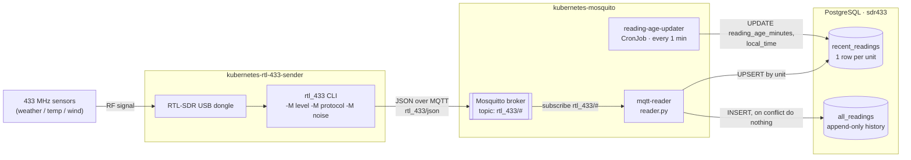

# Radio → Database Message Flow

How a 433 MHz sensor reading gets from the air to Postgres, spanning this repo
(`kubernetes-rtl-433-sender`) and `kubernetes-mosquito`.

## Hop by hop

| Stage | Component | Detail |
| --- | --- | --- |
| Capture | RTL-SDR + `rtl_433` | USB dongle picks up 433 MHz RF from wireless sensors; the `rtl_433` CLI (run via `entrypoint.sh`) demodulates and decodes it into JSON. |
| Publish | `rtl_433` → MQTT | Decoded readings are published as JSON to `rtl_433/json` on the broker, unretained. |
| Broker | Mosquitto 2 | Single-replica broker, anonymous access, in-cluster at `mosquitto.default.svc.cluster.local:1883`. |
| Consume | `mqtt-reader` | Subscribes to `rtl_433/#`, parses each payload, and writes two records per message. |
| Persist | PostgreSQL (`sdr433`) | `prod-postgres-rw`, credentials from the `sdr433-role-credentials` secret. |
| Enrich | `reading-age-updater` | Minutely CronJob recomputes reading age and local time on `recent_readings`. |

## The two tables `mqtt-reader` writes

- **`recent_readings`** — latest snapshot per device, one row per `unit`
  (model + sensor type + id/channel), upserted on every message. Refreshed
  with `reading_age_minutes` and `local_time` every minute.
- **`all_readings`** — full append-only history: `timestamp, model, id,
  channel, reading`. Duplicate inserts are silently dropped (`on conflict
  do nothing`).
